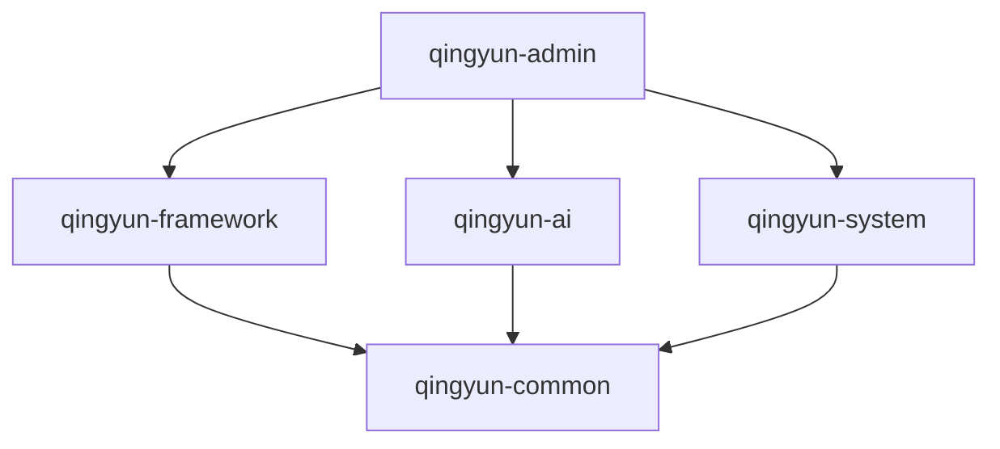

# 青云 e 后端多模块架构与开发规范

> 本项目基于 Spring Boot 3.4.0 + Java 21，采用 Maven 多模块分层架构。
> 核心原则：**单向依赖、高内聚低耦合、版本集中管控**。

## 1. 模块总览

```text
qingyun-e-system/                     ← 父工程 (packaging=pom)
├── qingyun-common      ← 公共基础层
├── qingyun-framework   ← 框架核心层     → 依赖 common
├── qingyun-ai          ← AI 服务层      → 依赖 common
├── qingyun-system      ← 业务数据层     → 依赖 common
└── qingyun-admin       ← Web 入口层     → 依赖 framework, system, ai
```

**依赖关系图（严格单向，禁止反向/循环）**：



---

## 2. 各模块职责详解

### 2.1 `qingyun-common` — 公共基础层

> **一句话定义**：全项目的"地基"，纯 Java 工具代码，不包含任何 Spring Bean 和业务逻辑。

| 包名         | 放什么               | 示例                                      |
| ------------ | -------------------- | ----------------------------------------- |
| `result`     | 统一响应体、分页封装 | `Result<T>`、`PageResult<T>`              |
| `exception`  | 自定义异常体系       | `QingyunException`、`ErrorCode` 枚举      |
| `enums`      | 全局通用枚举         | `UserStatus`、`GenderEnum`                |
| `context`    | 请求上下文工具       | `UserContext`（ThreadLocal 存储当前用户） |
| `utils`      | 通用工具类           | `DateUtils`、`StringUtils`、`IdGenerator` |
| `constant`   | 全局常量             | `Constants`、`RedisKeyConstant`           |
| `annotation` | 自定义注解           | `@Log`、`@RateLimiter`、`@NoAuth`         |

**核心约束**：
- ❌ 禁止出现 `@Service`、`@Component`、`@Configuration` 等 Spring 注解
- ❌ 禁止依赖 framework / system / ai 任何一个模块
- ✅ 可以依赖：Lombok、Jackson Annotations、Guava、Fastjson 等纯工具库
- ✅ 可以使用 `spring-web`（用于 `HttpStatus` 等基础类型），但不引入 `spring-boot-starter-web`

---

### 2.2 `qingyun-framework` — 框架核心层

> **一句话定义**：项目启动所需的**基础设施配置中心**，管理 Redis、RabbitMQ、安全认证、全局拦截等。

| 包名                | 放什么                 | 示例                                                         |
| ------------------- | ---------------------- | ------------------------------------------------------------ |
| `config.redis`      | Redis 序列化、缓存策略 | `RedisConfig`、`RedisService`（封装 RedisTemplate）          |
| `config.rabbitmq`   | 消息队列配置           | `RabbitMQConfig`（交换机/队列/死信绑定）                     |
| `config.threadpool` | 异步线程池             | `ThreadPoolConfig`（`@Async` 线程池参数）                    |
| `config.web`        | Web 层全局配置         | `CorsConfig`（跨域）、`Knife4jConfig`（接口文档）            |
| `security`          | 安全认证全套           | `SecurityConfig`、`JwtUtils`、`JwtAuthFilter`、`LoginUser`   |
| `web`               | 全局切面/拦截          | `GlobalExceptionHandler`（`@RestControllerAdvice`）、`LogAspect` |

**核心约束**：
- ❌ 禁止写任何业务 CRUD 代码
- ❌ 禁止写 Controller
- ✅ 只依赖 `qingyun-common`，不依赖 system / ai
- ✅ 此模块的配置类会被 `qingyun-admin` 通过依赖传递自动加载

**典型代码示例**：
```java
// GlobalExceptionHandler.java - 在 framework 中
@RestControllerAdvice
public class GlobalExceptionHandler {
    @ExceptionHandler(QingyunException.class)
    public Result<?> handleQingyunException(QingyunException e) {
        return Result.fail(e.getStatus().value(), e.getMessage());
    }
}
```

---

### 2.3 `qingyun-ai` — AI 与第三方服务层

> **一句话定义**：封装所有**外部服务能力**（大模型、向量库、云存储），对上层暴露干净的 Service 接口。

| 包名         | 放什么          | 示例                                                   |
| ------------ | --------------- | ------------------------------------------------------ |
| `llm`        | 大模型调用封装  | `ChatService`（提示词工程、结构化输出解析）            |
| `llm.prompt` | Prompt 模板管理 | `PromptTemplates`（系统提示词常量/模板）               |
| `vector`     | 向量检索交互    | `VectorStoreService`（Qdrant 写入/相似度检索）         |
| `embedding`  | 文本向量化      | `EmbeddingService`（调用 Embedding 模型）              |
| `storage`    | 云存储服务      | `OssService`（阿里云 OSS）、`CosService`（腾讯云 COS） |
| `mcp`        | MCP 工具调用    | `McpSearchService`（联网搜索）                         |

**核心约束**：
- ❌ 禁止写数据库 Mapper 和业务 Entity
- ❌ 禁止写 Controller
- ✅ 只依赖 `qingyun-common`
- ✅ 对外只暴露 Service 接口，内部实现细节（LangChain4j API、Qdrant gRPC）完全封装

**典型调用链路**：
```java
// admin Controller 调用示例
@RestController
public class ChatController {
    @Autowired private ChatService chatService;        // ← ai 层
    @Autowired private VectorStoreService vectorService; // ← ai 层
    @Autowired private IChatRecordService recordService;   // ← system 层

    @PostMapping("/chat")
    public Result<String> chat(@RequestBody ChatDTO dto) {
        String answer = chatService.chat(dto);          // 1. 调 AI 层生成回答
        vectorService.store(dto.getQuery(), answer);    // 2. 调 AI 层存向量
        recordService.save(dto, answer);                // 3. 调 system 层存 MySQL
        return Result.ok(answer);
    }
}
```

---

### 2.4 `qingyun-system` — 业务数据层

> **一句话定义**：纯粹的**数据库 CRUD 层**，包含 Entity → Mapper → Service 完整链路。

| 包名           | 放什么       | 示例                                                         |
| -------------- | ------------ | ------------------------------------------------------------ |
| `entity`       | 数据库实体类 | `User`、`Knowledge`、`ChatRecord`（带 `@TableName`、Jackson 注解） |
| `dto`          | 请求参数对象 | `UserCreateDTO`、`KnowledgeQueryDTO`（带 `@NotBlank` 校验注解） |
| `vo`           | 响应展示对象 | `UserVO`、`KnowledgeDetailVO`（脱敏、格式化后的数据）        |
| `mapper`       | 数据访问接口 | `UserMapper extends BaseMapper<User>`                        |
| `mapper.xml`   | 复杂 SQL     | `UserMapper.xml`（多表联查、动态 SQL）                       |
| `service`      | Service 接口 | `IUserService`、`IKnowledgeService`                          |
| `service.impl` | Service 实现 | `UserServiceImpl`、`KnowledgeServiceImpl`                    |

**核心约束**：
- ❌ **严禁出现 `@RestController`、`@RequestMapping`**（Controller 只属于 admin）
- ❌ 禁止依赖 framework 的 JWT/Security（业务层不应关心认证）
- ❌ 禁止依赖 ai 层的 LangChain4j（业务层不直接调大模型）
- ✅ 只依赖 `qingyun-common`
- ✅ Entity 类使用 Jackson 注解（`@JsonProperty`、`@JsonFormat`）处理序列化

**分层对象转换规范**：
```
Controller 接收 DTO → Service 转换为 Entity → Mapper 写入数据库
Mapper 查出 Entity → Service 转换为 VO → Controller 返回 Result<VO>
```

---

### 2.5 `qingyun-admin` — Web 入口层

> **一句话定义**：**唯一的启动入口和 API 出口**，Controller 只做"接参数 → 调 Service → 返 Result"。

| 包名                      | 放什么             | 示例                                                         |
| ------------------------- | ------------------ | ------------------------------------------------------------ |
| `controller`              | 所有 REST 接口     | `UserController`、`ChatController`、`KnowledgeController`    |
| `controller.admin`        | 后台管理接口       | `SysUserController`、`SysRoleController`                     |
| (根包)                    | Spring Boot 启动类 | `QingyunApplication.java`                                    |
| `resources/`              | 配置文件           | `application.yml`、`application-dev.yml`、`application-prod.yml` |
| `resources/db/migration/` | Flyway 迁移脚本    | `V1__init_schema.sql`、`V2__add_knowledge_table.sql`         |

**核心约束**：
- ❌ **严禁在 Controller 中写超过 10 行业务逻辑**（复杂逻辑下沉到 system 的 Service）
- ❌ 禁止直接写 Mapper 操作（数据访问通过 system 的 Service）
- ✅ 依赖 framework + system + ai 三个模块
- ✅ 唯一启用 `spring-boot-maven-plugin` 打包可执行 JAR 的模块
- ✅ 所有 `application-*.yml` 配置文件只放在此模块

**Controller 标准模板**：
```java
@Tag(name = "用户管理")
@RestController
@RequestMapping("/user")
public class UserController {
    @Autowired private IUserService userService;

    @Operation(summary = "分页查询用户")
    @GetMapping("/list")
    public Result<PageResult<UserVO>> list(UserQueryDTO dto) {
        return Result.ok(userService.pageList(dto));
    }
}
```

---

## 3. 依赖管理规范

### 3.1 版本集中管控

```
父 pom.xml 的 <properties> + <dependencyManagement> 锁定所有版本号
子模块 pom.xml 引入依赖时禁止填写 <version>
```

### 3.2 依赖引入原则

| 规则           | 说明                                                         |
| -------------- | ------------------------------------------------------------ |
| **单向依赖**   | common ← framework/ai/system ← admin，禁止反向               |
| **按需引入**   | 只有 `qingyun-ai` 引入 OSS SDK，其他模块不引入               |
| **传递不重复** | admin 通过 framework 传递获得 Web/Redis/Security，不重复声明 |
| **禁止循环**   | 出现循环依赖 = 代码放错了模块，必须重构                      |

### 3.3 新增依赖流程

1. 在**父 `pom.xml`** 的 `<properties>` 中添加版本变量
2. 在**父 `pom.xml`** 的 `<dependencyManagement>` 中声明依赖
3. 在**需要的子模块 `pom.xml`** 中引用（不写 `<version>`）

---

## 4. 开发落地指引

| 场景              | 在哪写                                                       |
| ----------------- | ------------------------------------------------------------ |
| 新增一个 API 接口 | `qingyun-admin/controller/` 下新建 Controller                |
| 新增一张数据表    | ① `system/entity/` 建 Entity ② `system/mapper/` 建 Mapper ③ `system/service/` 建 Service |
| 写复杂业务逻辑    | `qingyun-system/service/impl/` 中实现                        |
| 接入新的大模型    | `qingyun-ai/llm/` 中封装，暴露 Service 接口                  |
| 新增向量集合      | `qingyun-ai/vector/` 中扩展 `VectorStoreService`             |
| 新增 OSS 上传     | `qingyun-ai/storage/` 中扩展 `OssService`                    |
| 修改 Redis 配置   | `qingyun-framework/config/redis/`                            |
| 修改 JWT 逻辑     | `qingyun-framework/security/`                                |
| 新增全局异常类型  | `qingyun-common/exception/` 定义异常 + `framework/web/` 写处理逻辑 |
| 新增 Flyway 脚本  | `qingyun-admin/resources/db/migration/V{n}__描述.sql`        |
| 新增配置文件      | `qingyun-admin/resources/application-*.yml`                  |

---

## 5. 一次请求的完整链路

```
HTTP 请求
  │
  ▼
JwtAuthFilter (framework)          ← 校验 token
  │
  ▼
UserController (admin)             ← 接收参数、校验 DTO
  │
  ├─→ IUserService (system)        ← 业务逻辑 + MySQL 读写
  │      └─→ UserMapper
  │
  ├─→ ChatService (ai)             ← 调大模型生成回答
  │      └─→ LangChain4j API
  │
  └─→ VectorStoreService (ai)      ← 存入 Qdrant 向量库
         └─→ Qdrant gRPC
  │
  ▼
Result<T> (common)                 ← 统一响应格式返回
  │
  ▼
GlobalExceptionHandler (framework) ← 如果异常，统一拦截处理
```